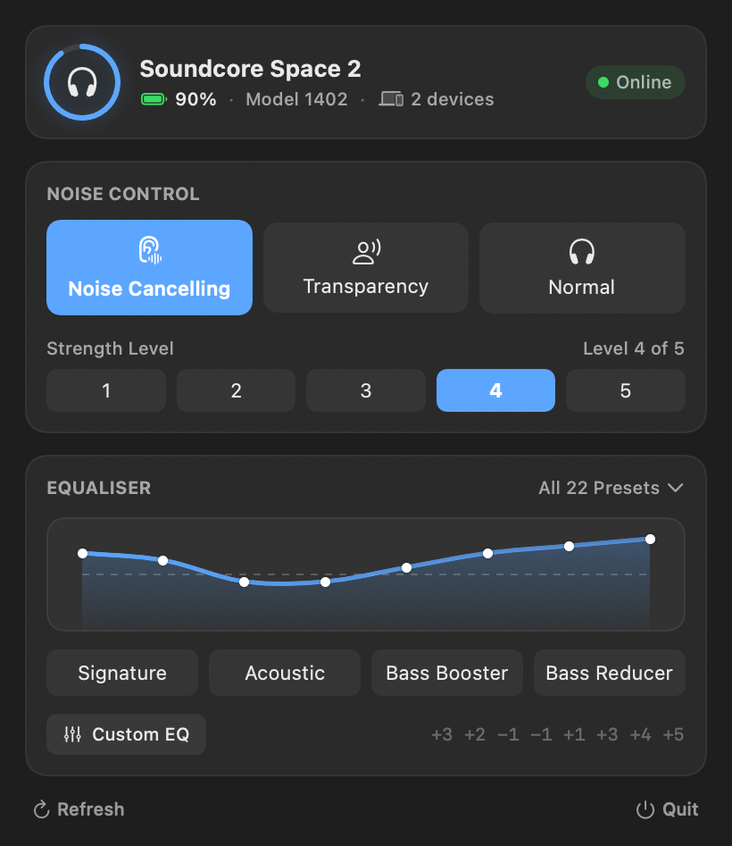

<p align="center">
  
</p>

<h1 align="center">SoundcoreBridge</h1>

<p align="center">Control your Soundcore headphones from your Mac.</p>

<p align="center">
  
</p>

## The problem

Your headphones pair with your Mac and play audio perfectly well. But the moment
you want to change noise cancelling or the equaliser, you have to pick up your
phone and open the Soundcore app — because Anker only ships it for Android and
iOS.

SoundcoreBridge puts those controls in your menu bar instead.

## What you get

- **Noise cancelling** — off, transparency, or on with strength 1–5
- **Equaliser** — all 22 presets, plus your own 8-band curve
- **Battery and firmware** at a glance
- **A command line tool**, if you want to script it

## Install

```sh
brew tap mervin008/tap
brew trust mervin008/tap
brew install --cask --no-quarantine mervin008/tap/soundcorebridge
```

Homebrew asks you to trust third-party casks, hence the middle line. The app
isn't notarised by Apple, which is what `--no-quarantine` takes care of.
Needs macOS 13 or later.

Prefer a download? Grab the zip from [releases](https://github.com/mervin008/soundcorebridge/releases/latest).

Or build it:

```sh
git clone https://github.com/mervin008/soundcorebridge
cd soundcorebridge && ./make-app.sh
```

## Command line

```sh
soundcorectl status
soundcorectl anc nc --level 5
soundcorectl eq rock
soundcorectl eq "6,4,2,0,0,-2,-4,-6"
```

## Supported headphones

| Device | Status |
|---|---|
| Soundcore Space 2 | Full control |
| Other Soundcore models | Battery and firmware only |

Only the Space 2 has been tested against real hardware, so it's the only one
that gets write access. Other models are read-only until someone can verify
them — if you have one, [open an issue](https://github.com/mervin008/soundcorebridge/issues)
and we can work out what it needs.

## How it works

The app speaks the same Bluetooth protocol the phone app uses, worked out by
watching real traffic. If you're curious about the details, they're in
[docs/protocol-map.md](docs/protocol-map.md).

## Credits

- **[SonyBridge](https://github.com/AmitRajput-Dev/SonyBridge)** by AmitRajput-Dev — showed that this was possible on macOS at all
- **[OpenSCQ30](https://github.com/Oppzippy/OpenSCQ30)** by Oppzippy — the reference Soundcore implementation
- **[SoundcoreManager](https://github.com/gmallios/SoundcoreManager)** by gmallios — earlier desktop client and protocol reference

## Co-engineered with Claude

The protocol was reverse engineered and this app built in collaboration with
[Claude](https://claude.com/claude-code) — packet captures decoded, the macOS
Bluetooth transport written and debugged, and every value verified against real
hardware rather than assumed.

## Contributing

Issues and pull requests welcome — see [CONTRIBUTING.md](CONTRIBUTING.md).

---

<sub>Not affiliated with Anker or Soundcore. MIT licensed.</sub>
