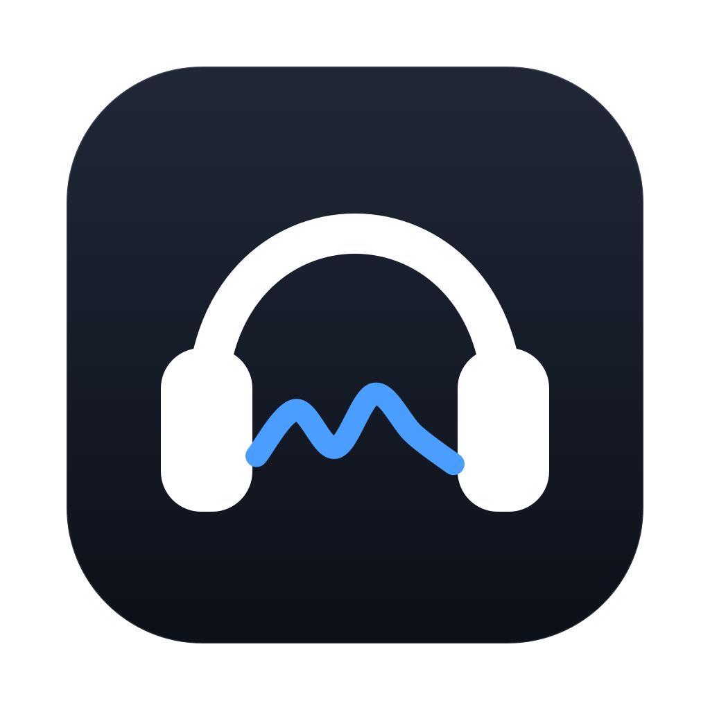

<p align="center">
  
</p>

<h1 align="center">SoundcoreBridge</h1>

<p align="center">Control your Soundcore headphones from your Mac.</p>

<p align="center">
  <a href="https://github.com/mervin008/soundcorebridge/stargazers"></a>
  <a href="https://github.com/mervin008/soundcorebridge/releases/latest"></a>
  <a href="LICENSE"></a>
  
</p>

<p align="center"><sub>Free and open source. If it saves you reaching for your phone, a ⭐ helps others find it.</sub></p>

<p align="center">
  
</p>

## The problem

Your headphones pair with your Mac and play audio perfectly well. But the moment
you want to change noise cancelling or the equaliser, you have to pick up your
phone and open the Soundcore app — because Anker only ships it for Android and
iOS.

SoundcoreBridge puts those controls in your menu bar instead.

## What you get

- **Noise cancelling** — off, transparency, or on with strength 1–5
- **Equaliser** — all 22 presets, plus your own 8-band curve
- **Battery and firmware** at a glance
- **A command line tool**, if you want to script it

## Install

| Platform | Status |
|---|---|
| **macOS 13+** | Available now |
| Windows | Coming soon |
| Linux | Coming soon |

The protocol layer is platform-independent — only the Bluetooth transport is
macOS-specific, so the other two are a port rather than a rewrite.

### macOS

```sh
brew tap mervin008/tap
brew trust mervin008/tap
brew install --cask --no-quarantine mervin008/tap/soundcorebridge
```

Homebrew asks you to trust third-party casks, hence the middle line. The app
isn't notarised by Apple, which is what `--no-quarantine` takes care of.
Needs macOS 13 or later.

Prefer a download? Grab the zip from [releases](https://github.com/mervin008/soundcorebridge/releases/latest).

Or build it:

```sh
git clone https://github.com/mervin008/soundcorebridge
cd soundcorebridge && ./make-app.sh
```

## Command line

```sh
soundcorectl status
soundcorectl anc nc --level 5
soundcorectl eq rock
soundcorectl eq "6,4,2,0,0,-2,-4,-6"
soundcorectl support-report --out support-report.txt
```

## Supported headphones

| Device | Status |
|---|---|
| Soundcore Space 2 | Full control |
| Space One · Q45 · Life series | In progress |
| Any other Soundcore model | Detected — battery and firmware only |

More models are being added. A device gets write access once its behaviour has
been confirmed on real hardware; until then it stays read-only rather than
guessing, because wrong offsets written to headphones are how they end up in
odd states.

Got one that isn't listed? [Open an issue](https://github.com/mervin008/soundcorebridge/issues/new/choose)
and include a support report from the clipboard button beside Quit in the app.
Reports include model, firmware, and profile details without Bluetooth names,
addresses, or raw packets. This helps identify what needs to be verified;
enabling controls still requires captures from the actual model.

## How it works

The app speaks the same Bluetooth protocol the phone app uses, worked out by
watching real traffic. If you're curious about the details, they're in
[docs/protocol-map.md](docs/protocol-map.md).

## Credits

- **[SonyBridge](https://github.com/AmitRajput-Dev/SonyBridge)** by AmitRajput-Dev — showed that this was possible on macOS at all
- **[OpenSCQ30](https://github.com/Oppzippy/OpenSCQ30)** by Oppzippy — the reference Soundcore implementation
- **[SoundcoreManager](https://github.com/gmallios/SoundcoreManager)** by gmallios — earlier desktop client and protocol reference

## Co-engineered with Claude

The protocol was reverse engineered and this app built in collaboration with
[Claude](https://claude.com/claude-code) — packet captures decoded, the macOS
Bluetooth transport written and debugged, and every value verified against real
hardware rather than assumed.

## Contributing

Issues and pull requests welcome — see [CONTRIBUTING.md](CONTRIBUTING.md).

## Support

Free and open source, and it stays that way. If it's useful:

- ⭐ [Star the repo](https://github.com/mervin008/soundcorebridge) — it's how people find it
- 🐛 [Report a bug or request a device](https://github.com/mervin008/soundcorebridge/issues/new/choose)
- 💛 [Sponsor](https://github.com/sponsors/mervin008) if you'd like to support the work

## Disclaimer

**SoundcoreBridge is not affiliated with, endorsed by, or connected to Anker
Innovations or Soundcore.** "Soundcore" and "Anker" are trademarks of their
respective owners and are used here only to describe compatibility.

This app talks to your headphones over a protocol that was reverse engineered
by observing traffic to hardware the author owns — lawful interoperability work.
Firmware-update channels are deliberately blocked and no firmware is modified.

It is nevertheless an undocumented protocol on hardware you paid for. **No
warranty is given, express or implied. Use at your own risk.**

Licensed under [MIT](LICENSE).
